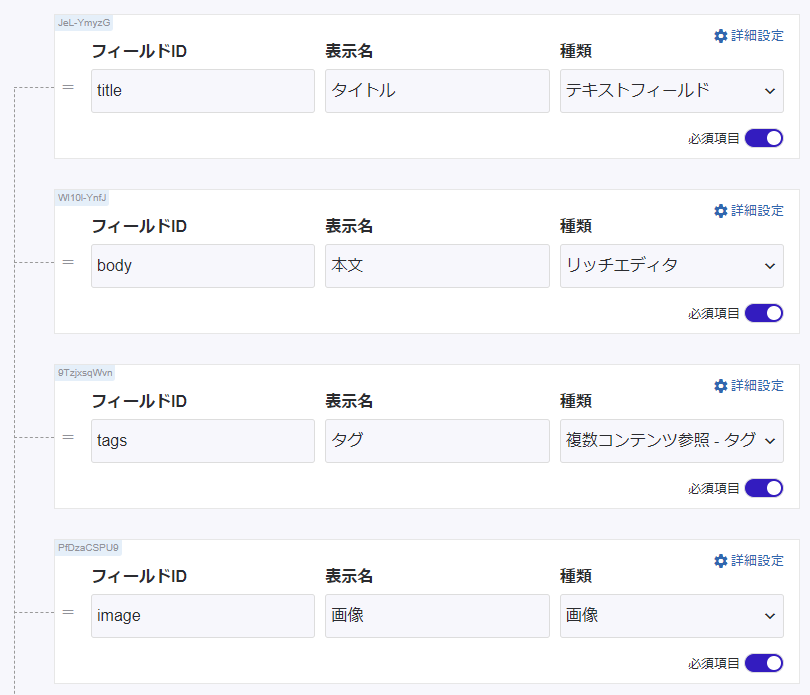
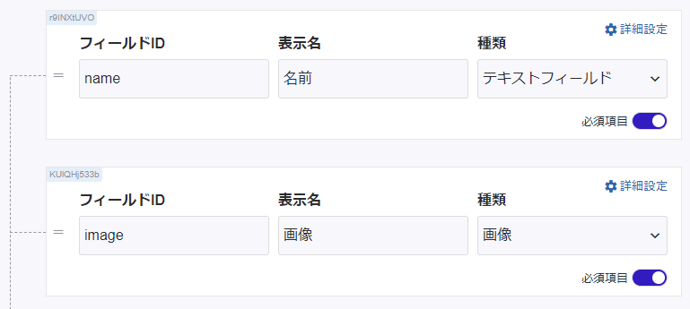

## aspidaを導入

インストール

```shell
yarn add @aspida/fetch
```

## 使用するAPIスキーマ

### Articles



### Tags



## 型定義ファイルの作成

### 共通

microCMSのAPIのリクエストとレスポンスで使用する共通の型を作成します。

```ts title="src/types/api.ts"
export type ContentsResponse<T> = {
 contents: T[];
 totalCount: number;
 offset: number;
 limit: number;
};
 
export type ContentResponse<T> = {
 id: string;
 createdAt: string;
 updatedAt: string;
 publishedAt: string;
 revisedAt: string;
} & T;
 
export type ContentsQuery = {
 draftKey?: string;
 offset?: number;
 limit?: number;
 orders?: string;
 q?: string;
 fields?: string;
 ids?: string;
 filters?: string;
 depth?: number;
};
 
export type ContentQuery = {
 draftKey?: string;
 fields?: string;
 depth?: number;
};
```

### Articles

記事用のレスポンスの型を作成します。

```ts title="src/types/article.ts"
import { ContentsResponse } from "./api";
import { TagResponse } from "./tag";
import { ImageResponse } from "./image";
 
export type ArticlesResponse = ContentsResponse<ArticleResponse>;
 
export type ArticleResponse = ContentResponse<{
 title?: string;
 body?: string;
 tags?: TagResponse[];
 image?: ImageResponse;
}>;
```

タグと画像用の型も作成します。

```ts title="src/types/tag.ts"
import { ContentResponse, ContentsResponse } from "./api";
import { ImageResponse } from "./image";
 
export type TagsResponse = ContentsResponse<TagResponse>;
 
export type TagResponse = ContentResponse<{
 name?: string;
 image?: ImageResponse;
}>;

src/types/image.ts
export type ImageResponse = {
 url?: string;
 height?: number;
 width?: number;
};
```

## aspidaの設定

プロジェクトルートに aspida.config.js を作成します。

```js title="aspida.config.js"
module.exports = {
 input: "src/apis",
};
```

aspida用の型定義ファイルを作成します。

```ts title="src/apis/articles/index.ts"
import { ContentsQuery } from "src/types/api";
import { ArticlesResponse } from "src/types/article";
 
export type Methods = {
 get: {
  query?: ContentsQuery;
  resBody: ArticlesResponse;
 };
};
```

```ts title="src/apis/articles/_id@string/index.ts"
import { ContentQuery } from "src/types/api";
import { ArticleResponse } from "src/types/article";
 
export type Methods = {
 get: {
  query?: ContentQuery;
  resBody: ArticleResponse;
 };
};
```

## $api.tsを生成

package.json の scripts に "api:build": "aspida" を追加します。

```json title="package.json"
"scripts": {
  "dev": "next dev",
  "build": "next build",
  "start": "next start",
  "api:build": "aspida"
 }
```

```shell
yarn api:build
```

上記を実行すると、src/apis/$api.ts が生成されます。

## APIを叩く

APIを叩く為の共通設定を utils/api.ts に持たせます。

```ts title="utils/api.ts"
import aspida from '@aspida/fetch'
import api from 'src/apis/$api'
 
const fetchConfig: Required<Parameters<typeof aspida>>[1] = {
 baseURL: 'https://[YOUR-SERVICE].microcms.io/api/v1/',
 throwHttpErrors: true,
 headers: {
  "X-API-KEY": '[YOUR-API-KEY]',
 },
};
 
export const client = api(aspida(fetch, fetchConfig));
```

シンプルにAPIを呼べるようになりました！

```ts
import { ArticlesResponse } from 'src/types/article'
import { client } from 'src/utils/api'
 
const response = await client.articles.$get()
```

0件目から、5件取得する場合

```ts
const response = await client.articles.$get({
 query: {
  offset: 0,
  limit: 5,
 },
})
```

IDから1件取得する場合

```ts
const id = 'content-id';
const response = await client.articles._id(id).$get()
```
